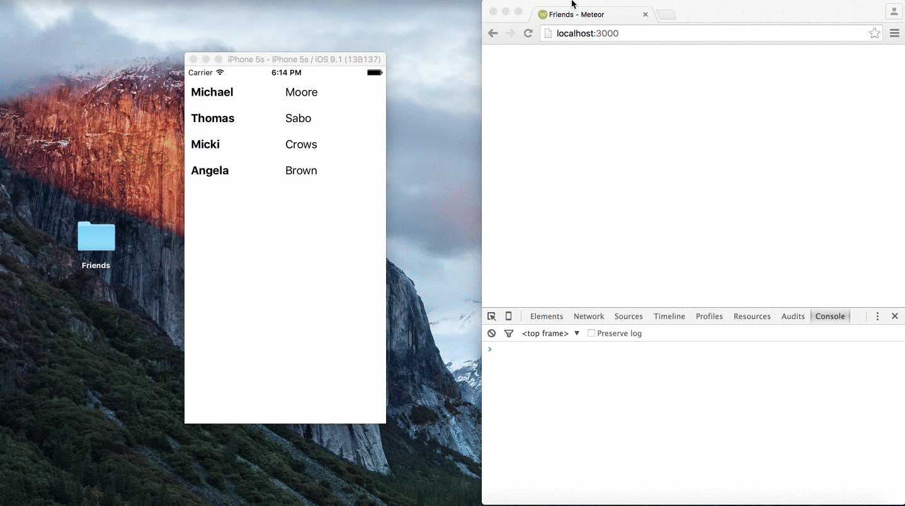

# Friends
Friends is an application which connects a Meteor backend to a React Native app
(Only the iOS version is available right now).

You can browse through a list a friends. Everything is reactive. Meteor talks
to the React Native app via DDP.

## Setup
The repository contains two applications. A Meteor application which serves
as a backend and a react native app.

1. Start the Meteor application
Start the Meteor application by `cd` into the Meteor application folder and
running `meteor`.

2. Install npm packages
`cd` into the react native project and run `npm update`.

3. Start the react native app
Just open the Xcode project and click on the run symbol.
